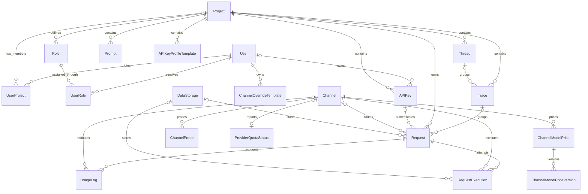

# AxonHub Entity Relationship Diagram (ERD)

## Purpose

This document gives a compact view of AxonHub's data domains and core relationships. It intentionally omits field inventories, database types, defaults, and indexes. The Ent schemas under `internal/ent/schema/` are the source of truth for those implementation details.

## Domain Overview

| Domain | Main entities | Responsibility |
|---|---|---|
| Identity and access | User, Project, UserProject, Role, UserRole, APIKey | Membership, authentication, ownership, and scoped access |
| Provider configuration | Model, Channel, ChannelModelPrice, ChannelModelPriceVersion | Available models, provider connections, and pricing |
| Request lifecycle | Request, RequestExecution, UsageLog | Inbound requests, provider attempts, usage, and cost |
| Observability | Thread, Trace, ChannelProbe, ProviderQuotaStatus | Request grouping and provider health |
| Storage and configuration | DataStorage, System, Prompt, PromptProtectionRule | Payload storage and reusable system configuration |
| Supporting access | OIDCIdentity, Invitation, APIKeyProfileTemplate, ChannelOverrideTemplate | Login identities, onboarding, and reusable templates |

### Hierarchical Structure

- **Global Level**: System-level configurations and resources shared by all Projects
- **Project Level**: Project-level resources belonging to specific Projects but also globally visible

### Permission Model

- **Owner**: Has all permissions and can manage all resources
- **Custom Roles + Scopes**: Fine-grained permission control through combination of roles and permission scopes

---

## Entity Detailed Description

### 1. User

**Description**: System user entity representing individuals or service accounts using AxonHub.

**Level**: Global

**Fields**:
- `id`: User unique identifier
- `email`: User email (unique)
- `status`: User status (activated/deactivated)
- `prefer_language`: User preferred language
- `password`: Password (sensitive field)
- `first_name`: First name
- `last_name`: Last name
- User avatars are served as a static asset through the GraphQL `UserInfo.avatar` field.
- `is_owner`: Whether system owner
- `scopes`: User-specific permission scopes (e.g., write_channels, read_channels, add_users, read_users, etc.)
- `created_at`: Creation time
- `updated_at`: Update time
- `deleted_at`: Soft deletion time

**Permissions**:
- Global Owner: Has all permissions
- Custom Roles + Scopes: Has specified permissions based on assigned roles and scopes

**Relationships**:
- Can belong to multiple Projects (through Project-User association)
- Can have multiple Roles
- Can create multiple API Keys
- Can initiate multiple Requests
- Can generate multiple Usage Logs

---

### 2. Project

**Description**: Project entity for organizing and isolating resources of different businesses or teams.

**Level**: Global (Projects themselves are managed globally)

**Fields**:
- `id`: Project unique identifier
- `name`: Project name
- `description`: Project description
- `status`: Project status
- `created_at`: Creation time
- `updated_at`: Update time
- `deleted_at`: Soft deletion time

**Permissions**:
- Project Owner: Has all permissions within the project
- Custom Roles + Scopes: Has specified permissions based on roles and scopes assigned within the project

**Relationships**:
- Contains multiple Users (project members)
- Contains multiple Project-level Roles
- Contains multiple API Keys
- Contains multiple Requests
- Contains multiple Usage Logs
- Contains multiple Threads
- Contains multiple Traces

---

### 3. Model

**Description**: AI model definition, representing available AI models from various providers.

**Level**: Global (shared by all Projects)

**Fields**:
- `id`: Model unique identifier
- `developer`: Developer of the model (e.g., deepseek, openai) - immutable
- `model_id`: Model identifier (e.g., deepseek-chat) - immutable
- `type`: Model type (chat/embedding/rerank) - immutable
- `name`: Model name (e.g., DeepSeek Chat)
- `icon`: Model icon from lobe-icons (e.g., DeepSeek)
- `group`: Model group (e.g., deepseek)
- `model_card`: Model card information (JSON)
- `settings`: Model settings (JSON)
- `status`: Model status (enabled/disabled/archived)
- `remark`: User-defined remark or note
- `created_at`: Creation time
- `updated_at`: Update time
- `deleted_at`: Soft deletion time

**Permissions**:
- Requires `read_channels` permission to read
- Requires `write_channels` permission to modify

**Relationships**: No direct associations

---

### 4. Channel

**Description**: AI service provider access channel configuration, such as OpenAI, Anthropic, Gemini, etc.

**Level**: Global (shared by all Projects)

**Fields**:
- `id`: Channel unique identifier
- `type`: Channel type (openai, anthropic, gemini_openai, deepseek, etc.) - immutable
- `base_url`: API base URL
- `name`: Channel name (unique)
- `status`: Channel status (enabled/disabled/archived)
- `credentials`: Channel credentials (sensitive field)
- `supported_models`: List of supported models
- `auto_sync_supported_models`: Auto sync supported models flag
- `default_test_model`: Default test model
- `settings`: Channel settings (includes model mappings, etc.)
- `tags`: Channel tags
- `ordering_weight`: Display ordering weight
- `error_message`: Error message (optional)
- `remark`: User-defined remark or note
- `created_at`: Creation time
- `updated_at`: Update time
- `deleted_at`: Soft deletion time

**Permissions**:
- Requires `read_channels` permission to read
- Requires `write_channels` permission to modify

**Relationships**:
- Can be used by multiple Requests
- Can be used by multiple Request Executions
- Associated with multiple Usage Logs

---

### 5. Channel Override Template

**Description**: User-defined templates for overriding channel request parameters and headers.

**Level**: User (private to each user)

**Fields**:
- `id`: Template unique identifier
- `user_id`: Owner user ID (immutable)
- `name`: Template name (unique per user and channel type)
- `description`: Template description
- `channel_type`: Channel type this template applies to
- `override_parameters`: Override request body parameters as JSON string
- `override_headers`: Override request headers (JSON array)
- `created_at`: Creation time
- `updated_at`: Update time
- `deleted_at`: Soft deletion time

**Permissions**:
- Users can only access their own templates
- Owner can access all templates

**Relationships**:
- Belongs to one User

---

### 6. Data Storage

**Description**: Data storage configuration for storing request/response data (database, filesystem, S3, GCS).

**Level**: Global (shared by all Projects)

**Fields**:
- `id`: Data storage unique identifier
- `name`: Data storage name
- `description`: Data storage description
- `primary`: Whether this is the primary data storage (immutable)
- `type`: Data storage type (database/fs/s3/gcs) - immutable
- `settings`: Data storage settings (JSON)
- `status`: Data storage status (active/archived)
- `created_at`: Creation time
- `updated_at`: Update time
- `deleted_at`: Soft deletion time

**Permissions**:
- Requires `read_data_storages` permission to read
- Requires `write_data_storages` permission to modify

**Relationships**:
- Can store multiple Requests
- Can store multiple Request Executions

---

### 7. System

**Description**: System-level configuration items, such as Logo, system name, and other global settings.

**Level**: Global (shared by all Projects)

**Fields**:
- `id`: Configuration unique identifier
- `key`: Configuration key (unique)
- `value`: Configuration value
- `created_at`: Creation time
- `updated_at`: Update time
- `deleted_at`: Soft deletion time

**Permissions**:
- Requires `read_settings` permission to read
- Requires `write_settings` permission to modify

**Relationships**: No direct associations

---

### 9. Role

**Description**: User role definition containing a set of permission scopes (Scopes).

**Level**: Can be Global or Project

**Fields**:
- `id`: Role unique identifier
- `name`: Role name
- `level`: Role level (global/project) - immutable
- `project_id`: Project ID (optional, required for Project-level roles)
- `scopes`: Permission scopes included in the role (e.g., write_channels, read_channels, add_users, read_users, etc.)
- `created_at`: Creation time
- `updated_at`: Update time
- `deleted_at`: Soft deletion time

**Permission Rules**:
- Global Roles can only configure Global Scopes
- Project Roles can configure both Global and Project Scopes

**Relationships**:
- Can be assigned to multiple Users
- Belongs to one Project (for Project-level roles)

---

### 10. Scope

**Description**: Fine-grained permission definition, such as `read_channels`, `write_requests`, etc.

**Level**: Can be Global, Project, or both

**Example Scopes**:
- `read_channels`: Read channels
- `write_channels`: Write channels
- `read_users`: Read users
- `write_users`: Write users
- `read_api_keys`: Read API Keys
- `write_api_keys`: Write API Keys
- `read_requests`: Read requests
- `write_requests`: Write requests
- `read_settings`: Read system settings
- `write_settings`: Write system settings
- `read_roles`: Read roles
- `write_roles`: Write roles
- `read_data_storages`: Read data storages
- `write_data_storages`: Write data storages

---

### 11. API Key

**Description**: API authentication key, each API Key belongs to a specific user and project.

**Level**: Project

**Fields**:
- `id`: API Key unique identifier
- `user_id`: Owning user ID (immutable)
- `project_id`: Owning project ID (immutable)
- `key`: API key (unique, immutable)
- `name`: API Key name
- `status`: Status (enabled/disabled/archived)
- `scopes`: API Key-specific permission scopes (default: read_channels, write_requests)
- `allowed_ips`: IP CIDR allowlist for this API key. If non-empty, only requests from matching source IPs are accepted.
- `profiles`: API Key profiles (JSON)
- `created_at`: Creation time
- `updated_at`: Update time
- `deleted_at`: Soft deletion time

**Permissions**:
- Users can only manage their own API Keys
- Owner can manage all API Keys

**Relationships**:
- Belongs to one User
- Belongs to one Project
- Can initiate multiple Requests

---

### 12. Thread

**Description**: Thread entity for organizing and tracking collections of related Traces, enabling request chain observability.

**Level**: Project

**Fields**:
- `id`: Thread unique identifier
- `project_id`: Owning project ID
- `thread_id`: Thread trace ID (unique)
- `created_at`: Creation time
- `updated_at`: Update time

**Permissions**:
- Users can only view and manage Threads within their projects
- Owner can view and manage all Threads

**Relationships**:
- Belongs to one Project
- Contains multiple Traces

---

### 13. Trace

**Description**: Trace entity for recording and tracking a set of related Requests, enabling distributed link tracing.

**Level**: Project

**Fields**:
- `id`: Trace unique identifier
- `project_id`: Owning project ID
- `trace_id`: Trace ID (unique)
- `thread_id`: Owning thread ID (optional)
- `created_at`: Creation time
- `updated_at`: Update time

**Permissions**:
- Users can only view and manage Traces within their projects
- Owner can view and manage all Traces

**Relationships**:
- Belongs to one Project
- Optionally belongs to one Thread
- Contains multiple Requests

---

### 14. Request

**Description**: AI model requests initiated by users via API or Playground.

**Level**: Project

**Fields**:
- `id`: Request unique identifier
- `api_key_id`: API Key ID (optional, empty for requests from Admin)
- `project_id`: Owning project ID
- `trace_id`: Owning trace ID (optional)
- `data_storage_id`: Data Storage ID (optional)
- `source`: Request source (api/playground/test) - immutable
- `model_id`: Model identifier
- `format`: Request format (e.g., openai/chat_completions, claude/messages)
- `request_body`: Raw request body (user format)
- `response_body`: Final response body (user format)
- `response_chunks`: Streaming response chunks
- `channel_id`: Used channel ID
- `external_id`: External system tracking ID
- `status`: Request status (pending/processing/completed/failed/canceled)
- `stream`: Whether it's a streaming request
- `metrics_latency_ms`: Total latency in milliseconds
- `metrics_first_token_latency_ms`: First token latency in milliseconds
- `created_at`: Creation time
- `updated_at`: Update time

**Permissions**:
- Users can only view and manage their own Requests
- Owner can view and manage all Requests

**Relationships**:
- Belongs to one Project
- Optionally associated with one API Key
- Optionally associated with one Trace
- Optionally associated with one Data Storage
- Optionally associated with one Channel
- Contains multiple Request Executions
- Associated with multiple Usage Logs

---

### 15. Request Execution

**Description**: Actual execution record of a Request on a specific Channel. A Request may have multiple executions (e.g., retries, fallback).

**Level**: Project (follows Request)

**Fields**:
- `id`: Execution unique identifier
- `project_id`: Project ID
- `request_id`: Associated request ID
- `channel_id`: Execution channel ID
- `data_storage_id`: Data Storage ID (optional)
- `external_id`: External system tracking ID
- `model_id`: Model identifier
- `format`: Request format
- `request_body`: Request body sent to provider (provider format)
- `response_body`: Response body returned by provider (provider format)
- `response_chunks`: Streaming response chunks (provider format)
- `error_message`: Error message
- `status`: Execution status (pending/processing/completed/failed/canceled)
- `metrics_latency_ms`: Total latency in milliseconds
- `metrics_first_token_latency_ms`: First token latency in milliseconds
- `created_at`: Creation time
- `updated_at`: Update time

**Relationships**:
- Belongs to one Request
- Uses one Channel
- Optionally uses one Data Storage

---

### 16. Usage Log

**Description**: Records token usage and cost information for each Request for statistics and billing.

**Level**: Project

**Fields**:
- `id`: Log unique identifier
- `request_id`: Associated request ID
- `project_id`: Owning project ID
- `channel_id`: Used channel ID
- `model_id`: Model identifier
- `prompt_tokens`: Prompt token count
- `completion_tokens`: Completion token count
- `total_tokens`: Total token count
- `prompt_audio_tokens`: Prompt audio token count
- `prompt_cached_tokens`: Prompt cached token count
- `completion_audio_tokens`: Completion audio token count
- `completion_reasoning_tokens`: Completion reasoning token count
- `completion_accepted_prediction_tokens`: Accepted prediction token count
- `completion_rejected_prediction_tokens`: Rejected prediction token count
- `source`: Request source (api/playground/test)
- `format`: Request format
- `created_at`: Creation time
- `updated_at`: Update time
- `deleted_at`: Soft deletion time

**Permissions**:
- Users can only view their own Usage Logs
- Owner can view all Usage Logs

**Relationships**:
- Belongs to one User
- Belongs to one Project
- Associated with one Request
- Optionally associated with one Channel

---

## Entity Relationship Diagram

### Mermaid ERD
### Mermaid ERD



## Relationship Notes

- A user can join multiple projects through `UserProject` and receive roles through `UserRole`.
- A role may be global or belong to a project; authorization is evaluated from ownership, membership, roles, and scopes.
- Every request belongs to a project. API key, trace, channel, and data-storage associations may be absent depending on the request source and processing stage.
- `Request` represents the client-facing operation. `RequestExecution` represents an individual provider attempt, so one request can have multiple executions because of retries or fallback.
- `UsageLog` records accounting data for a request and may attribute usage to a channel.
- `Thread` groups traces, and a trace groups related requests.

## Request Lifecycle

```text
API key or admin request
  -> Request
  -> one or more RequestExecution records
  -> UsageLog
```

Request and response payloads may remain in the primary database or be stored through `DataStorage`. The entity relationships remain the same in either case.

## Data Boundaries

- Project-owned records must retain their project scope throughout queries and mutations.
- Global resources such as channels, models, system settings, and data-storage definitions can be shared across projects, subject to authorization.
- Soft deletion is applied by the Ent schemas where historical identity or uniqueness must be preserved.

## Source of Truth

Use this document for domain orientation only. For exact fields, constraints, indexes, and generated database definitions, consult:

- `internal/ent/schema/` — authored entity definitions and relationships
- `internal/ent/migrate/schema.go` — generated migration schema
- `internal/server/biz/` — lifecycle and business invariants

## Related Resources

- [Transformation Flow Architecture](transformation-flow.md)
- [Fine-grained Permission Guide](../guides/permissions.md)
- [Tracing Guide](../guides/tracing.md)
