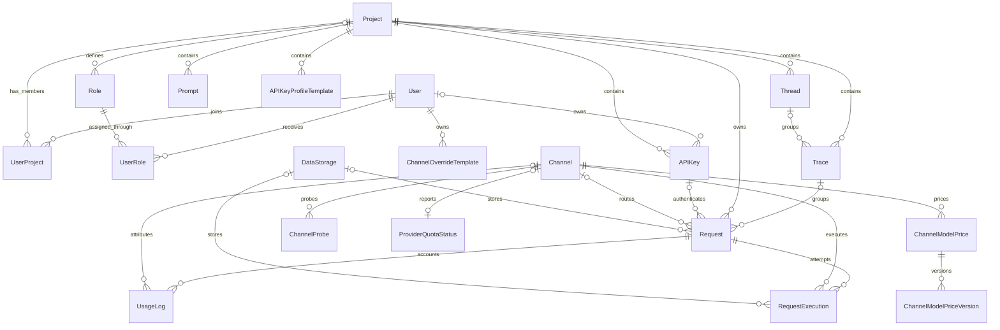

# AxonHub 实体关系图（ERD）

## 文档目的

本文档用于简要说明 AxonHub 的数据域和核心实体关系，不维护字段清单、数据库类型、默认值或索引。相关实现细节以 `internal/ent/schema/` 下的 Ent schema 为准。

## 数据域概览

| 数据域 | 主要实体 | 职责 |
|---|---|---|
| 身份与访问控制 | User、Project、UserProject、Role、UserRole、APIKey | 成员关系、认证、所有权和作用域权限 |
| 提供商配置 | Model、Channel、ChannelModelPrice、ChannelModelPriceVersion | 可用模型、提供商连接和定价 |
| 请求生命周期 | Request、RequestExecution、UsageLog | 入站请求、提供商执行、用量和成本 |
| 可观测性 | Thread、Trace、ChannelProbe、ProviderQuotaStatus | 请求分组和提供商健康状态 |
| 存储与配置 | DataStorage、System、Prompt、PromptProtectionRule | 请求载荷存储和可复用系统配置 |
| 辅助访问能力 | OIDCIdentity、Invitation、APIKeyProfileTemplate、ChannelOverrideTemplate | 登录身份、邀请和可复用模板 |

### 层级结构

- **Global Level（全局层级）**：系统级别的配置和资源，所有 Project 共享
- **Project Level（项目层级）**：项目级别的资源，属于特定 Project，但全局也可见

### 权限模型

- **Owner（所有者）**：拥有所有权限，可以管理所有资源
- **Custom Roles + Scopes（自定义角色 + 权限范围）**：通过角色和权限范围组合实现细粒度权限控制

---

## 实体详细说明

### 1. User（用户）

**描述**：系统用户实体，代表使用 AxonHub 的个人或服务账号。

**层级**：Global

**字段**：
- `id`: 用户唯一标识
- `email`: 用户邮箱（唯一）
- `status`: 用户状态（activated/deactivated）
- `prefer_language`: 用户偏好语言
- `password`: 密码（敏感字段）
- `first_name`: 名字
- `last_name`: 姓氏
- 用户头像作为静态资源，通过 GraphQL `UserInfo.avatar` 字段下发。
- `is_owner`: 是否为系统所有者
- `scopes`: 用户特定权限范围（如 write_channels, read_channels, add_users, read_users 等）
- `created_at`: 创建时间
- `updated_at`: 更新时间
- `deleted_at`: 软删除时间

**权限**：
- Global Owner：拥有所有权限
- Custom Roles + Scopes：根据分配的角色和权限范围拥有指定权限

**关联关系**：
- 可以属于多个 Projects（通过 Project-User 关联）
- 可以拥有多个 Roles（角色）
- 可以创建多个 API Keys
- 可以创建多个 Channel Override Templates

---

### 2. Project（项目）

**描述**：项目实体，用于组织和隔离不同业务或团队的资源。

**层级**：Global（项目本身是全局管理的）

**字段**：
- `id`: 项目唯一标识
- `name`: 项目名称
- `description`: 项目描述
- `status`: 项目状态
- `created_at`: 创建时间
- `updated_at`: 更新时间
- `deleted_at`: 软删除时间

**权限**：
- Project Owner：拥有项目内所有权限
- Custom Roles + Scopes：根据项目内分配的角色和权限范围拥有指定权限

**关联关系**：
- 包含多个 Users（项目成员）
- 包含多个 Project-level Roles
- 包含多个 API Keys
- 包含多个 Threads
- 包含多个 Traces
- 包含多个 Requests
- 包含多个 Usage Logs

---

### 3. Model（模型）

**描述**：AI 模型定义，代表来自各个提供商的可用 AI 模型。

**层级**：Global（所有 Project 共享）

**字段**：
- `id`: 模型唯一标识
- `developer`: 模型开发者（如 deepseek, openai）- 不可变
- `model_id`: 模型标识符（如 deepseek-chat）- 不可变
- `type`: 模型类型（chat/embedding/rerank）- 不可变
- `name`: 模型名称（如 DeepSeek Chat）
- `icon`: 模型图标（来自 lobe-icons，如 DeepSeek）
- `group`: 模型分组（如 deepseek）
- `model_card`: 模型卡片信息（JSON）
- `settings`: 模型设置（JSON）
- `status`: 模型状态（enabled/disabled/archived）
- `remark`: 用户自定义备注
- `created_at`: 创建时间
- `updated_at`: 更新时间
- `deleted_at`: 软删除时间

**权限**：
- 需要 `read_channels` 权限读取
- 需要 `write_channels` 权限修改

**关联关系**：无直接关联

---

### 4. Channel（渠道）

**描述**：AI 服务提供商的接入渠道配置，如 OpenAI、Anthropic、Gemini 等。

**层级**：Global（所有 Project 共享）

**字段**：
- `id`: 渠道唯一标识
- `type`: 渠道类型（openai, anthropic, gemini_openai, deepseek 等）- 不可变
- `base_url`: API 基础 URL
- `name`: 渠道名称（唯一）
- `status`: 渠道状态（enabled/disabled/archived）
- `credentials`: 渠道凭证（敏感字段）
- `supported_models`: 支持的模型列表
- `auto_sync_supported_models`: 自动同步支持模型标志
- `default_test_model`: 默认测试模型
- `settings`: 渠道设置（包含模型映射等）
- `tags`: 渠道标签
- `ordering_weight`: 显示排序权重
- `error_message`: 错误信息（可选）
- `remark`: 用户自定义备注
- `created_at`: 创建时间
- `updated_at`: 更新时间
- `deleted_at`: 软删除时间

**权限**：
- 需要 `read_channels` 权限读取
- 需要 `write_channels` 权限修改

**关联关系**：
- 可以被多个 Requests 使用
- 可以被多个 Request Executions 使用
- 关联多个 Usage Logs
- 拥有一个 Channel Performance 记录

---

### 5. Channel Performance（渠道性能）

**描述**：渠道性能指标，跟踪成功率、延迟和吞吐量。

**层级**：Global（关联 Channel）

**字段**：
- `id`: 性能记录唯一标识
- `channel_id`: 关联的渠道 ID（唯一，不可变）
- `success_rate`: 成功率百分比
- `avg_latency_ms`: 平均延迟（毫秒）
- `avg_token_per_second`: 平均每秒 Token 数
- `avg_stream_first_token_latency_ms`: 流式请求平均首字延迟
- `avg_stream_token_per_second`: 流式请求平均每秒 Token 数
- `last_success_at`: 最后成功请求时间戳
- `last_failure_at`: 最后失败请求时间戳
- `request_count`: 总请求数
- `success_count`: 总成功请求数
- `failure_count`: 总失败请求数
- `total_token_count`: 所有请求的总 Token 数
- `total_request_latency_ms`: 总请求延迟（毫秒）
- `stream_success_count`: 总成功流式请求数
- `stream_total_request_count`: 总流式请求数
- `stream_total_token_count`: 流式请求总 Token 数
- `stream_total_request_latency_ms`: 流式请求总延迟（毫秒）
- `stream_total_first_token_latency_ms`: 流式请求总首字延迟
- `consecutive_failures`: 连续失败次数
- `created_at`: 创建时间
- `updated_at`: 更新时间
- `deleted_at`: 软删除时间

**权限**：继承自 Channel

**关联关系**：
- 属于一个 Channel

---

### 6. Channel Override Template（渠道覆盖模板）

**描述**：用户定义的模板，用于覆盖渠道请求参数和请求头。

**层级**：User（每个用户私有）

**字段**：
- `id`: 模板唯一标识
- `user_id`: 所有者用户 ID（不可变）
- `name`: 模板名称（对每个用户和渠道类型唯一）
- `description`: 模板描述
- `channel_type`: 模板适用的渠道类型
- `override_parameters`: 覆盖请求体参数（JSON 字符串）
- `override_headers`: 覆盖请求头（JSON 数组）
- `created_at`: 创建时间
- `updated_at`: 更新时间
- `deleted_at`: 软删除时间

**权限**：
- 用户只能访问自己的模板
- Owner 可以访问所有模板

**关联关系**：
- 属于一个 User

---

### 7. Data Storage（数据存储）

**描述**：数据存储配置，用于存储请求/响应数据（数据库、文件系统、S3、GCS）。

**层级**：Global（所有 Project 共享）

**字段**：
- `id`: 数据存储唯一标识
- `name`: 数据存储名称
- `description`: 数据存储描述
- `primary`: 是否为主数据存储（不可变）
- `type`: 数据存储类型（database/fs/s3/gcs）- 不可变
- `settings`: 数据存储设置（JSON）
- `status`: 数据存储状态（active/archived）
- `created_at`: 创建时间
- `updated_at`: 更新时间
- `deleted_at`: 软删除时间

**权限**：
- 需要 `read_data_storages` 权限读取
- 需要 `write_data_storages` 权限修改

**关联关系**：
- 可以存储多个 Requests
- 可以存储多个 Request Executions

---

### 8. System（系统配置）

**描述**：系统级别的配置项，如 Logo、系统名称等全局设置。

**层级**：Global（所有 Project 共享）

**字段**：
- `id`: 配置唯一标识
- `key`: 配置键（唯一）
- `value`: 配置值
- `created_at`: 创建时间
- `updated_at`: 更新时间
- `deleted_at`: 软删除时间

**权限**：
- 需要 `read_settings` 权限读取
- 需要 `write_settings` 权限修改

**关联关系**：无直接关联

---

### 9. Role（角色）

**描述**：用户角色定义，包含一组权限范围（Scopes）。

**层级**：可以是 Global 或 Project

**字段**：
- `id`: 角色唯一标识
- `name`: 角色名称
- `level`: 角色层级（global/project）- 不可变
- `project_id`: 项目 ID（可选，Project-level 角色必填）
- `scopes`: 角色包含的权限范围（如 write_channels, read_channels, add_users, read_users 等）
- `created_at`: 创建时间
- `updated_at`: 更新时间
- `deleted_at`: 软删除时间

**权限规则**：
- Global Role 只能配置 Global Scopes
- Project Role 可以配置 Global 和 Project Scopes

**关联关系**：
- 可以分配给多个 Users
- 属于一个 Project（Project-level 角色）

---

### 10. Scope（权限范围）

**描述**：细粒度的权限定义，如 `read_channels`、`write_requests` 等。

**层级**：可以是 Global、Project 或同时存在

**示例 Scopes**：
- `read_channels`: 读取渠道
- `write_channels`: 写入渠道
- `read_users`: 读取用户
- `write_users`: 写入用户
- `read_api_keys`: 读取 API Keys
- `write_api_keys`: 写入 API Keys
- `read_requests`: 读取请求
- `write_requests`: 写入请求
- `read_settings`: 读取系统设置
- `write_settings`: 写入系统设置
- `read_roles`: 读取角色
- `write_roles`: 写入角色
- `read_data_storages`: 读取数据存储
- `write_data_storages`: 写入数据存储

---

### 11. API Key（API 密钥）

**描述**：用于 API 认证的密钥，每个 API Key 属于特定用户和项目。

**层级**：Project

**字段**：
- `id`: API Key 唯一标识
- `user_id`: 所属用户 ID（不可变）
- `project_id`: 所属项目 ID（不可变）
- `key`: API 密钥（唯一，不可变）
- `name`: API Key 名称
- `status`: 状态（enabled/disabled/archived）
- `scopes`: API Key 特定权限范围（默认：read_channels, write_requests）
- `allowed_ips`: 此 API Key 的 IP CIDR 白名单。如果非空，仅接受来自匹配源 IP 的请求。
- `profiles`: API Key 配置文件（JSON）
- `created_at`: 创建时间
- `updated_at`: 更新时间
- `deleted_at`: 软删除时间

**权限**：
- 用户只能管理自己的 API Keys
- Owner 可以管理所有 API Keys

**关联关系**：
- 属于一个 User
- 属于一个 Project
- 可以发起多个 Requests

---

### 12. Thread（线程）

**描述**：线程实体，用于组织和追踪相关的 Trace 集合，实现请求链路的可观测性。

**层级**：Project

**字段**：
- `id`: 线程唯一标识
- `project_id`: 所属项目 ID
- `thread_id`: 线程追踪 ID（唯一）
- `created_at`: 创建时间
- `updated_at`: 更新时间

**权限**：
- 用户只能查看和管理项目内的 Threads
- Owner 可以查看和管理所有 Threads

**关联关系**：
- 属于一个 Project
- 包含多个 Traces

---

### 13. Trace（追踪）

**描述**：追踪实体，用于记录和追踪一组相关的 Request，实现分布式链路追踪。

**层级**：Project

**字段**：
- `id`: 追踪唯一标识
- `project_id`: 所属项目 ID
- `trace_id`: 追踪 ID（唯一）
- `thread_id`: 所属线程 ID（可选）
- `created_at`: 创建时间
- `updated_at`: 更新时间

**权限**：
- 用户只能查看和管理项目内的 Traces
- Owner 可以查看和管理所有 Traces

**关联关系**：
- 属于一个 Project
- 可选属于一个 Thread
- 包含多个 Requests

---

### 14. Request（请求）

**描述**：用户通过 API 或 Playground 发起的 AI 模型请求。

**层级**：Project

**字段**：
- `id`: 请求唯一标识
- `api_key_id`: API Key ID（可选，来自 Admin 的请求为空）
- `project_id`: 所属项目 ID
- `trace_id`: 所属追踪 ID（可选）
- `data_storage_id`: 数据存储 ID（可选）
- `source`: 请求来源（api/playground/test）- 不可变
- `model_id`: 模型标识
- `format`: 请求格式（如 openai/chat_completions, claude/messages）
- `request_body`: 原始请求体（用户格式）
- `response_body`: 最终响应体（用户格式）
- `response_chunks`: 流式响应块
- `channel_id`: 使用的渠道 ID
- `external_id`: 外部系统追踪 ID
- `status`: 请求状态（pending/processing/completed/failed/canceled）
- `stream`: 是否为流式请求
- `metrics_latency_ms`: 总延迟（毫秒）
- `metrics_first_token_latency_ms`: 首字延迟（毫秒）
- `created_at`: 创建时间
- `updated_at`: 更新时间

**权限**：
- 用户只能查看和管理自己的 Requests
- Owner 可以查看和管理所有 Requests

**关联关系**：
- 属于一个 Project
- 可选关联一个 API Key
- 可选关联一个 Trace
- 可选关联一个 Data Storage
- 可选关联一个 Channel
- 包含多个 Request Executions
- 关联多个 Usage Logs

---

### 15. Request Execution（请求执行）

**描述**：Request 在特定 Channel 上的实际执行记录，一个 Request 可能有多次执行（如重试、fallback）。

**层级**：Project（跟随 Request）

**字段**：
- `id`: 执行唯一标识
- `project_id`: 项目 ID
- `request_id`: 关联的请求 ID
- `channel_id`: 执行的渠道 ID
- `data_storage_id`: 数据存储 ID（可选）
- `external_id`: 外部系统追踪 ID
- `model_id`: 模型标识
- `format`: 请求格式
- `request_body`: 发送给提供商的请求体（提供商格式）
- `response_body`: 提供商返回的响应体（提供商格式）
- `response_chunks`: 流式响应块（提供商格式）
- `error_message`: 错误信息
- `status`: 执行状态（pending/processing/completed/failed/canceled）
- `metrics_latency_ms`: 总延迟（毫秒）
- `metrics_first_token_latency_ms`: 首字延迟（毫秒）
- `created_at`: 创建时间
- `updated_at`: 更新时间

**关联关系**：
- 属于一个 Request
- 使用一个 Channel
- 可选使用一个 Data Storage

---

### 16. Usage Log（使用日志）

**描述**：记录每个 Request 的 Token 使用情况和成本信息，用于统计和计费。

**层级**：Project

**字段**：
- `id`: 日志唯一标识
- `request_id`: 关联的请求 ID
- `project_id`: 所属项目 ID
- `channel_id`: 使用的渠道 ID
- `model_id`: 模型标识
- `prompt_tokens`: Prompt Token 数量
- `completion_tokens`: Completion Token 数量
- `total_tokens`: 总 Token 数量
- `prompt_audio_tokens`: Prompt 音频 Token 数量
- `prompt_cached_tokens`: Prompt 缓存 Token 数量
- `completion_audio_tokens`: Completion 音频 Token 数量
- `completion_reasoning_tokens`: Completion 推理 Token 数量
- `completion_accepted_prediction_tokens`: 接受的预测 Token 数量
- `completion_rejected_prediction_tokens`: 拒绝的预测 Token 数量
- `source`: 请求来源（api/playground/test）
- `format`: 请求格式
- `created_at`: 创建时间
- `updated_at`: 更新时间

**权限**：
- 用户只能查看自己的 Usage Logs
- Owner 可以查看所有 Usage Logs

**关联关系**：
- 属于一个 Project
- 关联一个 Request
- 可选关联一个 Channel

---

## 实体关系图

### Mermaid ERD
### Mermaid ERD



## 关系说明

- 用户通过 `UserProject` 加入多个项目，并通过 `UserRole` 获得角色。
- 角色可以是全局角色，也可以属于特定项目；权限由所有权、成员关系、角色和 scopes 共同决定。
- 每个请求都属于一个项目。API Key、Trace、Channel 和 DataStorage 关联可能因请求来源或处理阶段而为空。
- `Request` 表示面向客户端的一次请求，`RequestExecution` 表示一次具体的提供商执行；重试或故障转移会产生多个执行记录。
- `UsageLog` 保存请求的计量信息，并可将用量归属到具体渠道。
- `Thread` 用于组织 Trace，Trace 用于组织相关 Request。

## 请求生命周期

```text
API Key 或管理员请求
  -> Request
  -> 一个或多个 RequestExecution
  -> UsageLog
```

请求与响应载荷可以保存在主数据库，也可以通过 `DataStorage` 存储；两种方式不会改变实体关系。

## 数据边界

- 项目级数据在查询和写入过程中必须保持项目作用域。
- Channel、Model、System 和 DataStorage 定义等全局资源可以由多个项目共享，但仍受权限控制。
- 需要保留历史身份或唯一性语义的实体，由 Ent schema 配置软删除。

## 事实来源

本文档只用于理解数据域。精确字段、约束、索引和生成后的数据库定义请查看：

- `internal/ent/schema/`：手工维护的实体定义和关系
- `internal/ent/migrate/schema.go`：生成的迁移 schema
- `internal/server/biz/`：生命周期和业务约束

## 相关资源

- [转换流程架构](transformation-flow.md)
- [细粒度权限指南](../guides/permissions.md)
- [追踪指南](../guides/tracing.md)
